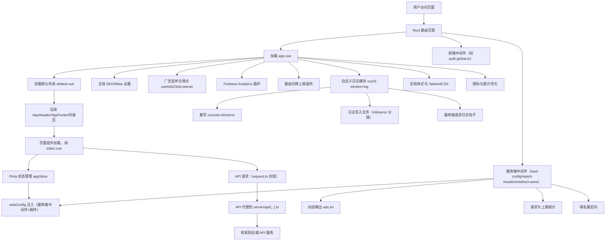

# synjoy-nuxt-template 技术方案说明

## 一、项目简介

本项目基于 Nuxt 3 + Vue 3 + TypeScript，结合 Pinia 状态管理、Element Plus 组件库、TailwindCSS 原子化样式、Winston 日志、Firebase 分析、服务端中间件等，构建现代化 Web 应用模板，支持多端适配、广告集成、灵活配置和高可维护性。

---

## 二、技术栈与核心依赖

- **前端框架**：Nuxt 3 (Vue 3, Composition API, SSR)
- **状态管理**：Pinia
- **代码规范化**：`@nuxt/eslint`、`stylistic`
- **UI 组件**库：Element Plus
- **样式方案**：TailwindCSS4、SCSS
- **图标方案**：`@nuxt/icon`，支持本地 SVG 图标和自定义 Logo
- **图片优化**：`@nuxt/image`
- **设备检测**：`@nuxtjs/device` + 自定义 useCustomDevice
- **API 封装**：`$fetch` 二次封装，统一错误处理
- **日志系统**：自研 `nuxt3-winston-log` 模块，基于 `winston` + `daily-rotate-file`
- **路由系统**：自定义路由系统，支持多渠道
- **广告与分析**：Google AdSense、AdExchange、Firebase Analytics、`useAdsClickListener`、TikTok/Facebook/Bigo 埋点
- **类型系统**：TypeScript 全面类型约束
- **开发工具**：Vite、ESLint、Sass、vue-tsc
- **CI/CD**：支持 Docker 部署，内置 `run.sh` 脚本

---

## 三、目录结构

```plain text
├── app
│   ├── api/                            # API 接口
│   │   ├── index.ts                    # API 统一导出
│   │   └── modules/                    # API 模块
│   ├── assets/                         # 静态资源
│   │   ├── icons/                      # SVG 图标
│   │   └── styles/                     # 样式文件
│   ├── components/                     # 公共组件
│   │   ├── Adsby/                      # 广告组件
│   │   └── App/                        # 公共 Header 和 Footer 组件
│   ├── composables/                    # 组合式函数
│   │   ├── useAdsClickListener.ts      # 广告点击监听
│   │   ├── useCustomDevice.ts          # 设备检测
│   │   ├── useCustomRouting.ts         # 路由跳转
│   │   ├── useTikTokTrack.ts           # TikTok 统计
│   │   ├── useFBTrack.ts               # Facebook 统计
│   │   └── useBigoTrack.ts             # Bigo 统计
│   ├── layouts/                        # 布局组件
│   ├── middleware/                     # 路由中间件
│   │   ├── auth.global.ts              # 用户认证
│   │   └── validate-channel.global.ts  # 渠道验证
│   ├── pages/                          # 路由页面
│   │   └── [[channel]]/                # 多渠道页面
│   │       ├── (legal)/                # 法律条款相关页面
│   │       └── index.vue               # 首页
│   ├── plugins/                        # 插件
│   │   ├── firebase.client.ts          # Firebase 分析
│   │   ├── load-config.server.ts       # 服务端配置加载
│   │   └── route-reporter.client.ts    # 路由切换上报
│   ├── stores/                         # 状态管理
│   │   ├── app.ts                      # 全局状态管理
│   │   └── user.ts                     # 用户状态管理
│   ├── utils/                          # 工具函数
│   │   ├── constants.ts                # 常量
│   │   ├── index.ts                    # 工具函数
│   │   └── request.ts                  # API 请求封装
│   ├── web-configs.ts                  # 网站配置
│   └── app.vue                         # 应用入口
├── modules/                            # Nuxt 模块
│   └── nuxt3-winston-log/              # 自定义日志模块
├── public/                             # 公共资源
│   ├── images/                         # 网站图片
│   ├── logos/                          # 网站 Logo
│   └── health.html                     # 健康检查文件
├── logs/                               # 服务端日志
├── server/                             # 服务端
│   ├── api/                            # 后端接口
│   │   ├── [...].ts                    # API 代理
│   │   └── report.ts                   # 路由切换上报
│   ├── middleware/                     # 中间件
│   │   ├── load-config.ts              # 根据域名加载配置
│   │   ├── report-headers.ts           # 请求头上报统计
│   │   └── redirect-www.ts             # 域名重定向
│   ├── plugins/                        # 插件
│   │   └── extend-html.ts              # 动态注入 favicon、广告脚本、meta 信息
│   └── utils/                          # 工具函数
├── types/                              # 类型定义
├── Dockerfile                          # Docker 配置
├── run.sh                              # 部署脚本
├── nuxt.config.ts                      # Nuxt 配置
├── tsconfig.json                       # TypeScript 配置
├── package.json                        # 项目配置
```

---

## 四、前端实现细节

### 1. 页面与布局

- 入口 `app.vue` 负责全局 SEO、Loading、布局切换。
- 默认布局 `layouts/default.vue` 统一头部、底部、内容区。
- 页面文件夹支持多渠道（[[channel]]）和法务页面（about-us、privacy-policy 等）。

### 2. 组件化

- 头部、底部、广告等均为独立组件，支持响应式和多端适配。
- 图标、Logo 支持本地 SVG 动态加载。

### 3. 状态管理

- `stores/app.ts` 管理全局配置、菜单状态等。
- `stores/user.ts` 预留用户登录、信息、登出等逻辑。

### 4. API 封装

- `utils/request.ts` 基于 `$fetch` 封装 `get/post`，统一拦截、错误处理、401 跳转。
- `api/modules/` 目录定义业务 API 类型与请求方法。
- `api/index.ts` 汇总导出。

> 项目统一要求，所有的接口请求都通过服务端进行代理转发

1️⃣ 在 `/app/utils/request.ts` 中封装自定义的请求方法，可设置 baseURL 和响应拦截器等

```typescript
/**
 * @name 请求方法封装
 * @description 封装 $fetch 方法
 */
import type { NitroFetchOptions, NitroFetchRequest } from "nitropack";

export type RequestParams = NitroFetchOptions<
  NitroFetchRequest,
  "options" | "get" | "head" | "patch" | "post" | "put" | "delete" | "connect" | "trace"
>;

/** 自定义封装 $fetch 方法 */
export const customFetch = $fetch.create({
  // 设置请求根路径
  baseURL: "/api",
  // 设置超时时间为 20 秒
  timeout: 1000 * 20,
  // 请求拦截器
  onRequest({ options }) {
    // 设置请求根路径
    options.baseURL = "/api";

    // const { webConfig } = useAppStore()

    // options.headers.set('home_template', '2')
  },
  // 响应拦截器
  onResponse({ response }) {
    if (!response.ok) {
      console.error("请求失败", response.statusText);
      throw new Error(`请求错误：${response.status}`);
    }

    // 与后端约定的数据响应格式
    const { data, code, msg, success } = response._data;

    if (!success) {
      console.error("接口错误：", msg);
      // 创建一个包含完整错误信息的错误对象
      const error = new Error(msg || "接口错误");
      // 将接口返回的所有信息附加到错误对象上
      Object.assign(error, { code, data, success });
      throw error;
    }

    // 通过修改 response._data 来修改响应数据
    response._data = data;
  },
  // 响应错误拦截器
  onResponseError({ response }) {
    if (response.status === 401) {
      navigateTo("/login");
    }
  },
});

/** 自动导出方法 */
export const request = {
  get<T>(url: string, params?: RequestParams) {
    return customFetch<T>(url, { method: "get", ...params });
  },
  post<T>(url: string, data?: Record<string, unknown>, params?: RequestParams) {
    return customFetch<T>(url, { method: "post", body: data, ...params });
  },
};
```

2️⃣ 在 `/app/api/modules/xxx.ts` 中定义各模块各接口的请求方法

```typescript
// api/modules/user.ts 登录模块接口
/** 登录 */
export const login = (data: { ggToken: string }) => {
  return request.post<UserResponse>("/user/login", data);
};

/** 退出登录 */
export const logout = async () => {
  return request.get("/user/logout");
};
```

3️⃣ 在 `/app/api/index.ts` 中汇总导出所有模块的请求方法并导出

```typescript
// api/index.ts 汇总各模块请求函数，统一导出
import * as defaultApi from "./modules/default";
import * as userApi from "./modules/user";

export const api = {
  defaultApi,
  userApi,
};
```

4️⃣ 在 `nuxt.config.ts` 中配置自动导入

```typescript
export default defineNuxtConfig({
  imports: {
    dirs: ["api"], // api 文件夹顶层路径中的资源会被自动导入
  },
});
```

5️⃣ 在组件中使用

```html
<script setup lang="ts">
  /** 获取推荐列表 */
  const { data: homeContent } = await useAsyncData("homeContent", api.defaultApi.requestHomeContent);
</script>
```

6️⃣ 在 `server/api/[...].ts` 中配置本地开发代理

```typescript
import { joinURL } from "ufo";

export default defineEventHandler(async (event) => {
  const runtimeConfig = useRuntimeConfig();
  const proxyUrl = runtimeConfig.public.apiBase || "";

  // 替换开头 的/api，用 正则表达式
  const path = event.path.replace(/^\/api/, "");
  const target = joinURL(proxyUrl, path);

  return proxyRequest(event, target);
});
```

### 5. 组合式函数

- `useCustomRouting`：路由跳转参数保留（如 channel、db）。
- `useAdsClickListener`：广告点击监听与多渠道埋点。
- `useFBTrack`、`useTikTokTrack`、`useBigoTrack`：第三方埋点。

### 6. 插件机制

- `firebase.client.ts`：集成 Firebase Analytics，自动上报事件。
- `route-reporter.client.ts`：路由切换自动上报。
- `load-config.server.ts`：服务端渲染时将配置注入 Pinia。

### 7. 样式与适配

- 全局样式 main.scss、tailwind.css，支持 PC/移动端响应式。
- 支持自定义断点、媒体查询。

### 8. 广告组件

- 封装 `<AdsbyGoogle>` 和 `<AdsbyExchange>` 广告组件

**使用该组件**

`ads-attrs` 是一个对象，只需要传递 `data-ad-slot` 属性即可，其他属性均已设置默认值，如果需要覆盖则可自行传递，会覆盖默认值

```html
<AdsbyGoogle :ads-attrs="adSense?.home_1" />
```

**广告调试**

在 `url` 后面增加 `db` `query`参数即可，如 `www.xxx.com?db=1`，表示开启 debug 模式

## 五、服务端实现细节

### 1. API 代理与上报

- `server/api/[...].ts`：通用 API 代理，转发到环境变量配置的后端。
- `server/api/report.ts`：路由切换上报，采集 header、host、path、时间戳等。

### 2. 中间件

- `load-config.ts`：根据 host 注入对应 webConfig，并处理 /ads.txt。
- `report-headers.ts`：请求头上报到统计后端。
- `redirect-www.ts`：www 域名重定向。

### 3. 插件

- `extend-html.ts`：动态注入 favicon、广告脚本、meta 信息等。

### 4. 工具

- `utils/index.ts`：如 getHost，辅助中间件和 API。

---

## 六、自定义日志系统

- `modules/nuxt3-winston-log/`：自研 Nuxt3 日志模块
  - 支持 info/error 分级、日志轮转、压缩归档
  - 自动重写 console.info/error，统一输出到文件和控制台
  - 可配置日志路径、文件名、保留天数、最大体积
  - 支持服务端请求日志钩子

---

## 七、配置与多环境支持

- `web-configs.ts` 支持多 host 配置，自动按 host 注入
- 支持多广告位、埋点、邮箱、Logo、描述等
- 通过中间件和插件自动注入到前端 Pinia
- 支持 /ads.txt 动态输出

---

## 八、CI/CD 与部署

- `Dockerfile` 支持容器化部署
- `run.sh` 一键启动
- 支持多环境变量（.env.development/.production/.stage）
- 推荐使用 pnpm 管理依赖

---

## 九、最佳实践与扩展建议

- 组件、API、状态、工具分层清晰，便于扩展
- 推荐按业务模块拆分 API、Store、Composables
- 日志、埋点、广告等均可按需裁剪
- 支持多站点/多渠道/多语言扩展

---

## 主流程调用关系图


